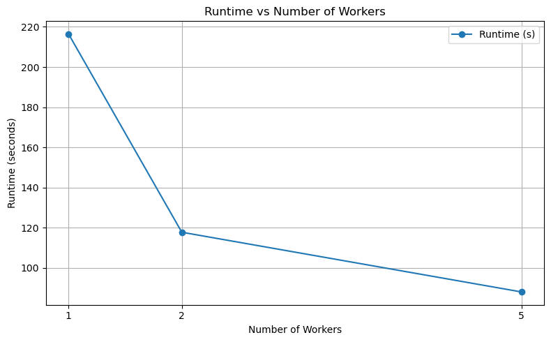
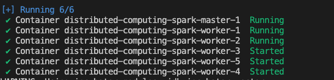
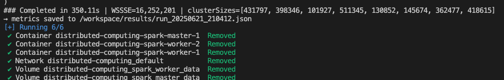
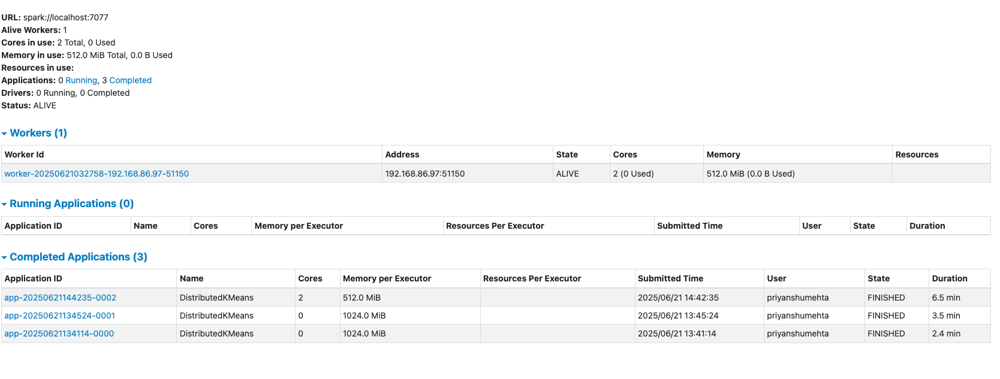

A **turn-key research sandbox** that lets you run, benchmark and analyse the
distributed version of the classic *K-Means* clustering algorithm on a
containerised Spark cluster **without touching Hadoop or a cloud account**.The repo powers a full experimental pipeline—data ingest, cluster
provisioning, job submission, metrics capture, result visualisation—on **any
laptop with ≥ 8 GB RAM**.

> *Use it for coursework, for a quick demo in your data-engineering talk, or
> as a seed repo for more advanced distributed-ML explorations.*


---

## Table of Contents
1. [Quick Start](#quick-start)
2. [Project Tour](#project-tour)
3. [Sample Results](#sample-results)
4. [Documentation](#documentation)
5. [FAQ](#faq)
6. [Citation](#citation)


---

## Quick Start

```bash
git clone https://github.com/your-handle/distributed-computing.git
cd distributed-computing
./docs/INSTALLATION.md           # ⇠ full setup guide
make pull-images                 # pulls Spark base image & builds custom layer

# ➋ single-node baseline
scripts/run_local.sh             # ≈ 3 min on 8-core/8 GB laptop

# ➌ scale to 5 executors & half-data
WORKERS=5 scripts/run_once.sh 5 --fraction 0.5

# ➍ tear everything down
scripts/clean.sh
````

Spark’s Web UI will be available at **[http://localhost:18081](http://localhost:18081)** for the duration
of each run.


## Project Tour

```text
.
├── data/           ← SUSY Higgs dataset (2.4 GB)
├── src/            ← PySpark job + utilities
├── scripts/        ← Bash helpers for cluster lifecycle & experiments
├── docs/
│   ├── INSTALLATION.md
│   ├── ARCHITECTURE.md
│   └── RESULTS.md
├── docker-compose.yml  ← defines master + worker services
└── results/        ← JSON + logs produced by each run
```

| Path                   | What you’ll find                                               |
| ---------------------- | -------------------------------------------------------------- |
| `src/kmeans_job.py`    | 70-line, pure-PySpark implementation of K-Means + metrics dump |
| `scripts/run_once.sh`  | Idempotent “scale → run → tear-down” wrapper                   |
| `docs/ARCHITECTURE.md` | Deep dive into container, storage & shuffle design             |
| `docs/RESULTS.md`      | PhD-level performance analysis, plots & discussion             |

## Execution Screenshots

<div align="center">

### Five Workers Configuration



*Distributed processing with 5 worker nodes*

### K-Means Clustering Results



*Machine learning algorithm visualization*

### Two Workers Configuration



*Comparison setup with 2 worker nodes*

</div>


## Results

| Workers | Dataset Fraction | Runtime (s) | WSSSE (↓ better) |
| :-----: | :--------------: | ----------: | ---------------: |
|    1    |  1.0 (5 M rows)  |   **216.4** |       32 465 190 |
|    2    |        1.0       |       117.8 |       32 536 283 |
|    5    |        0.5       |        88.1 |       16 252 200 |


*Speed-up flattens after ≈ 4 workers due to broadcast & scheduler overhead; see
docs/RESULTS.md for full derivation.*

---

## Documentation

| Doc                                         | One-liner                                            |
| ------------------------------------------- | ---------------------------------------------------- |
| **[INSTALLATION.md](docs/INSTALLATION.md)** | Conda, Docker & dataset setup with copy-paste blocks |
| **[ARCHITECTURE.md](docs/ARCHITECTURE.md)** | Container topology, partition strategy, memory model |
| **[RESULTS.md](docs/RESULTS.md)**           | Experimental methodology, plots, statistical tests   |

