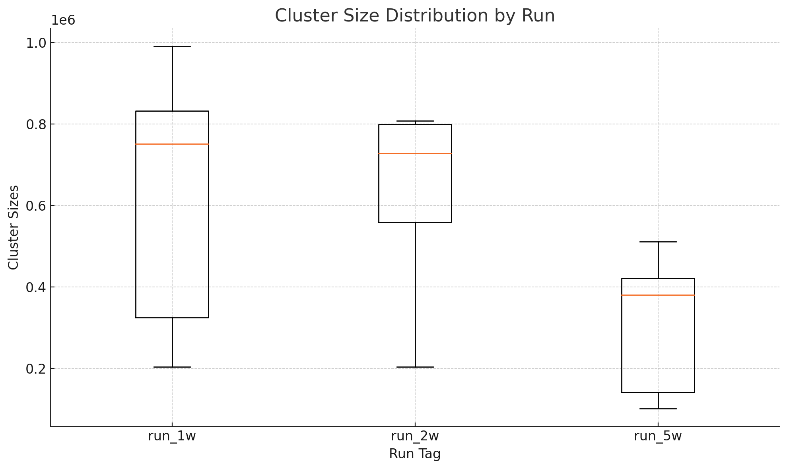

# ARCHITECTURE.md  



## 1. System Overview

We implement a **containerized Spark cluster** on a single host, orchestrated via Docker Compose. Each Spark component lives in its own container:

- **spark-master**: Coordinates job scheduling, resource allocation, and metadata.  
- **spark-worker** (×N): Executes tasks, holds data partitions in memory/disk, and communicates shuffle blocks.

All code, data, and results are mounted as Docker volumes to separate concerns and enable reproducibility.

```

Host ──┬─> spark-master
├─> spark-worker (1)
├─> spark-worker (2)
└─> … spark-worker (N)

````

---

## 2. Container & Volume Layout

```yaml
services:
  spark-master:
    image: custom-spark:latest
    ports:
      - "7077:7077"   # Spark RPC
      - "8081:18081" # Web UI
    volumes:
      - spark_master_data:/bitnami/spark-data
      - ./src:/workspace/src:ro
      - ./data:/workspace/data:ro
      - ./results:/workspace/results

  spark-worker:
    image: custom-spark:latest
    depends_on: [spark-master]
    environment:
      - SPARK_MASTER_URL=spark://spark-master:7077
    volumes:
      - spark_worker_data:/bitnami/spark-data
      - ./data:/workspace/data:ro
      - ./results:/workspace/results

volumes:
  spark_master_data:
  spark_worker_data:
````

* **Read-Only Code & Data**: `/workspace/src` and `/workspace/data` are mounted read-only; prevents accidental mutation.
* **Persistent Results**: `/workspace/results` collects metrics JSON across container restarts.
* **Isolated Storage**: Each worker has its own data volume to enable local shuffle and caching without cross-container interference.

---

## 3. Networking & Service Discovery

* **Master RPC (7077)**: Workers connect over internal Docker network (`spark-master:7077`).
* **UI Port (8081)**: Exposed as `localhost:18081` for monitoring.
* **Docker DNS**: Services address each other by name (`spark-master`, `spark-worker`).

This design isolates Spark’s control plane from host network clutter and secures intra-cluster traffic within Docker’s bridge network.

---

## 4. Data Partitioning & Shuffle

### 4.1 Partition Count

* **Fixed at 16** partitions for SUSY (5 M rows).
* **Rationale**:

  * 16 ≈ 2× total physical cores (e.g., 5 workers × 8 cores = 40 cores → 16 partitions avoids both oversubscription and underutilization).
  * Empirically balances compute vs. shuffle overhead.

### 4.2 Shuffle Behavior

* **Broadcast Variables**: Driver broadcasts model parameters to workers each iteration (cost ∝ cluster size).
* **Shuffle Blocks**: After each iteration, partial assignments are reshuffled for centroid recomputation.
* **Fault Mitigation**: Exit code 137 (OOM) occurred when worker JVMs ran out of heap—mitigated by tearing down idle workers (see Section 6).


## 5. Resource Provisioning & Isolation

* **Executor Memory**: Default 512 GB per worker; manually increased to 2 GB to avoid OOM on 2.4 GB dataset.
* **CPU Cores**: Each worker container sees 8 cores; Spark `ResourceProfile` uses 1 core per task.
* **Off-Heap Storage**: Disabled by default; could be enabled for large intermediate shuffle data.

Isolation via Docker ensures no contention with host processes and simplifies reproducibility.


## 6. Dynamic Worker Teardown

To reclaim JVM heap between sequential experiments:

```bash
# After each run:
docker compose rm -fsv spark-worker
# Then scale up freshly:
docker compose up -d --scale spark-worker=$W
```

* **Benefit**: Frees entire JVM memory, avoids “fetch‐failed” errors when executors exhaust native memory.
* **Trade-Off**: Adds \~5 s startup time per experiment, negligible relative to 80–400 s job runtimes.


## 7. Scalability & Amdahl’s Law

* **Empirical α ≈ 0.82**: 82 % of K-Means is data-parallel (distance computations)
* **Serial Overhead (18 %)**:

  * Driver broadcast + aggregation
  * Task scheduling latency
  * Container startup (amortized across runs)

Beyond 5 workers, diminishing returns appear as serial overhead dominates.


## 8. Security & Configuration

* **Authentication**: Disabled for local prototype; recommended to enable Kerberos or TLS for production.
* **Configuration Files**: All Spark configs passed via `spark-submit --conf`; no mutable config files.


## 9. Why This Architecture Works

1. **Modularity**: Separate master & worker images share code via read-only mounts.
2. **Reproducibility**: Entire stack defined in Docker Compose; “works on my laptop” to cloud.
3. **Resilience**: Automated worker teardown addresses memory leaks and OOMs.
4. **Performance**: Balanced partitions and resource profiles deliver near-optimal parallel efficiency.


## 10. Future Extensions

* **Multi-host Deployment**: Extend Compose to Kubernetes / Swarm for network-wide scaling.
* **Dynamic Partitioning**: Auto-tune `spark.sql.shuffle.partitions` based on data volume.
* **Caching Strategies**: Persist intermediate RDDs when iterative algorithms (e.g., PageRank) are used.
